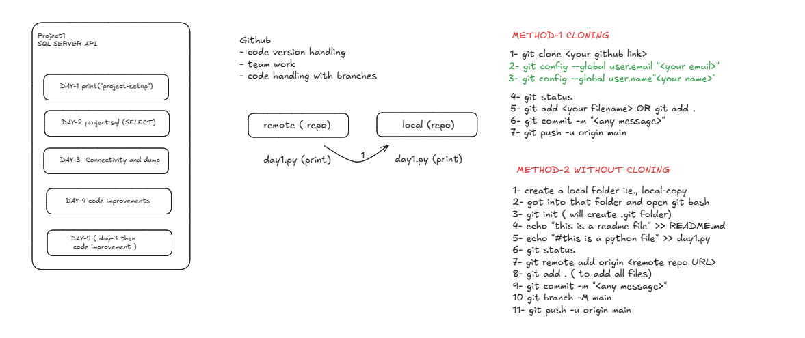

excaidraw: https://excalidraw.com/#json=4MaOt5d0wSl2h2fvrz0rA,b1P67PsUd-tSJVFsxWj2Lg

## METHOD-1 CLONING

-git clone
-git config --global user.email "" # one time
-git config --global user.name"" # one time
-git status
-git add OR git add .
-git commit -m ""
-git push -u origin main

## METHOD-2 WITHOUT CLONING

-create a local folder i:e., local-copy
-got into that folder and open git bash
-git init ( will create .git folder)
-echo "this is a readme file" >> README.md
-echo "#this is a python file" >> day1.py
-git status
-git remote add origin
-git add . ( to add all files)
-git commit -m ""
-git branch -M main
-git push -u origin main